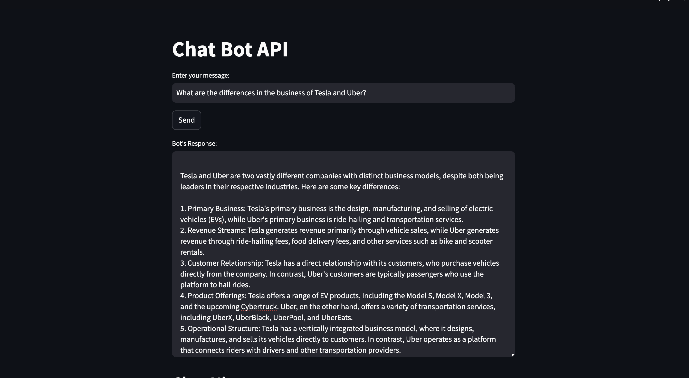

# LLM ChatBot CompanyData

# Content Engine

The Content Engine is a system designed to analyze and compare multiple PDF documents, specifically focusing on Form 10-K filings of multinational companies. It utilizes Retrieval Augmented Generation (RAG) techniques to retrieve, assess, and generate insights from these documents.

## Table of Contents
1. [Setup](#setup)
   - [Backend Framework](#backend-framework)
   - [Frontend Framework](#frontend-framework)
   - [Vector Store](#vector-store)
   - [Embedding Model](#embedding-model)
   - [Local Language Model (LLM)](#local-language-model-llm)
2. [Initialization](#initialization)
   - [Provided Documents](#provided-documents)
3. [Development](#development)
   - [Document Parsing](#document-parsing)
   - [Vector Generation](#vector-generation)
   - [Vector Store Integration](#vector-store-integration)
   - [Query Engine Configuration](#query-engine-configuration)
   - [LLM Integration](#llm-integration)
   - [Chatbot Interface](#chatbot-interface)
4. [Interface Sample](#interface-sample)
5. [Expected Outcome/Guidelines](#expected-outcomeguidelines)
6. [Repository Link](#repository-link)
7. [Documentation](#documentation)

## Setup

### Backend Framework
Choose between LlamaIndex or LangChain based on your preference and project requirements:
- **LlamaIndex:** A flexible framework for creating custom retrieval systems.
- **LangChain:** A toolkit focused on retrieval-augmented generation with strong LLM support.

### Frontend Framework
The user interface is built using Streamlit, an open-source app framework for creating interactive web applications.

### Vector Store
Choose a vector store to manage and query document embeddings locally:
- Options include ChromaDB, Pinecone, Faiss, Milvus, Weaviate, etc.

### Embedding Model
Select an embedding model to generate vectors from PDF content locally, ensuring no reliance on external services.

### Local Language Model (LLM)
Integrate a local instance of a Large Language Model for contextual insights, ensuring data privacy.

## Initialization

### Provided Documents
The system is initialized with Form 10-K filings of three multinational companies:
1. Alphabet Inc.
2. Tesla, Inc.
3. Uber Technologies, Inc.

## Development

### Document Parsing
Extract text and structure from PDFs to prepare them for analysis.

### Vector Generation
Generate embeddings (vectors) from document content using the selected embedding model.

### Vector Store Integration
Persist embeddings locally using the chosen vector store for efficient querying.

### Query Engine Configuration
Set up tasks to retrieve and compare documents based on their embeddings.

### LLM Integration
Integrate a local instance of a Large Language Model to provide contextual insights and generate information summaries.

### Chatbot Interface
Implement a Streamlit-based chatbot interface for user interaction, allowing users to query and compare information across documents.

## Interface LLM Results

